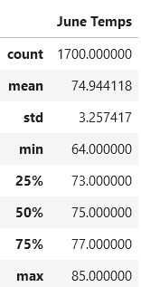
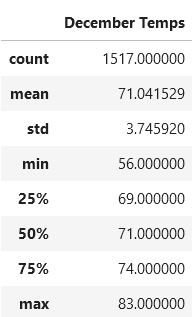

# surfs_up
## Overview of the analysis
Analize the temperature data for the months of June and December in Oahu, in order to determine if the surf and ice cream shop business is sustainable year-round.

## Analysis
 ### Temperatures recorded in June
 Query of the temperature readings for June on Oahu yeild the following data:

From the temperature statistics for June we see that:
- The lowest temperature was 64
- the highest temperature was 85
- with an average temperature of approximately 75

### Temperatures recorded in December
Query of the temperature readings for December on Oahu yeild the following data:

From the temperature statistics for December we see that:
- The lowest temperature was 56
- the highest temperature was 83
- with an average temperature of approximately 71

## Summary
The query results for June and December domenstrate that this should be a fine location for teh surf and ice cream shop. Even though the lowest temperature in December did drop down to 56, the average temperature is a moderate 71, with the opportunity for even warmer days, even up to 85. Two other queries that might help with the decision are a Precipitation analysis of June and a precipitation analysis for December. The results of which are as follows:

June Precipitation:

December Precipitation:

Which indicate very similar precipitation expectations, with December having only slightly more precipitation.
